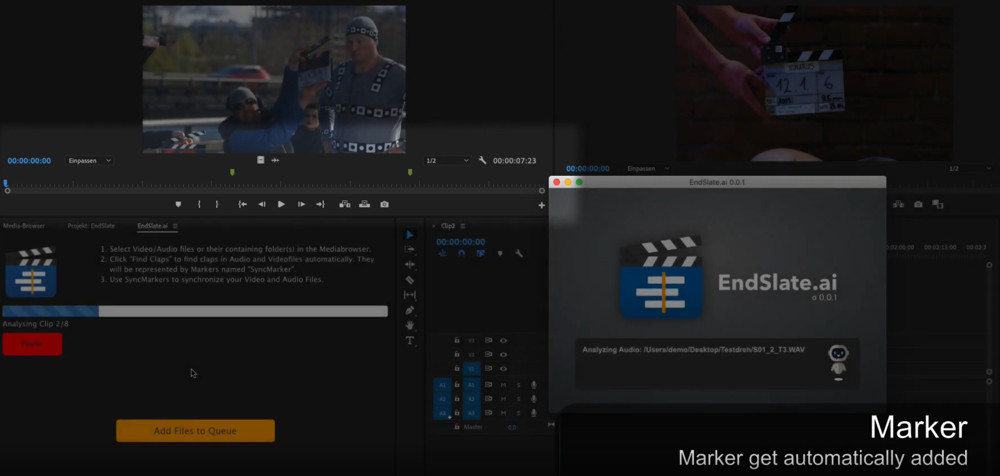
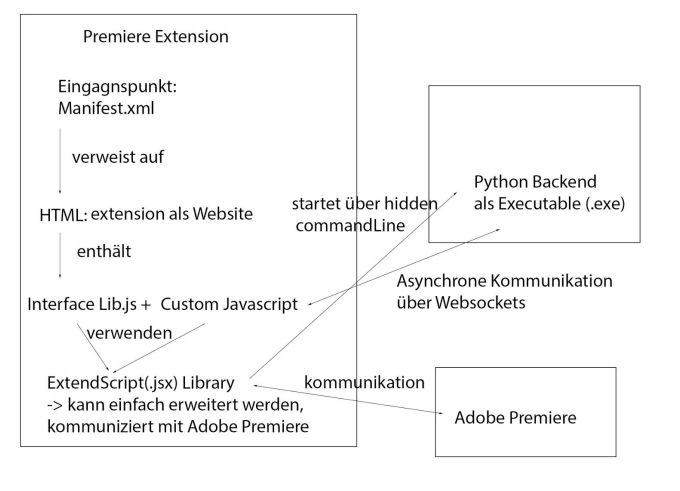
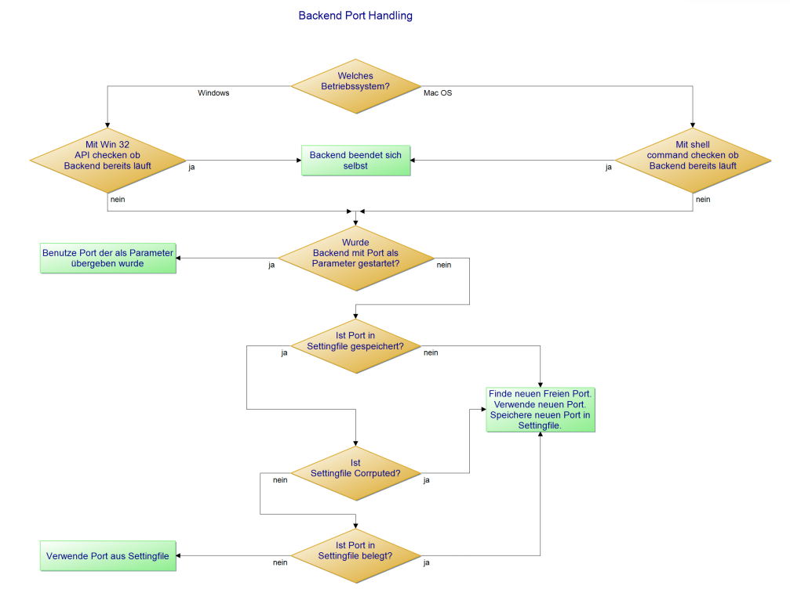
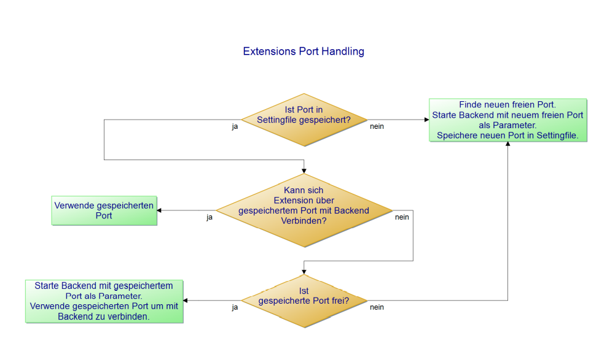

# Endslate.ai - an Adobe Premiere plugin

Endslate.AI is a software project which deals with
workflow simplification in the film editing process. It automatically examines film and audio material and synchronizes them based on the clapperboard. 

Solution |   Solution
:-------------------------:|:-------------------------:
|||

Demovideo:

A Demovideo can be viewed [here](https://www.youtube.com/watch?v=-t_eVzIAoeY)

## Architecture:

Our software solution basically consists of an extension for Premiere, with the help of which files can be selected and 
a backend in which the inference runs. The extension can be programmed as a web page, which can access and change elements of the Premiere GUI with the help of Adobe's own 
Javascript Interface Library to access and modify elements of the Premiere GUI. It is able to start the backend and to communicate with it 
communicate with it via TCP sockets.

### Backend

The backend integrates inference for video data with Yolov3 and Tensorflow CPU and inference for audio data with 
Mobilenet and PlaidML:
- Asynchronous communication with Premiere Extension
- multithreaded: inference of each audio/video is started in a separate thread
- Video data is read in with ffmpeg: Several formats supported
- Inference with Tensorflow CPU or PlaidML(CPU/GPU) possible
- BatchPrediction: SpeedUp
- simple GUI

### Adobe Premiere Extension
- Finds backend installation folder using registry
- Finds free port and saves it in config file
- Starts Backend automatically if it is not already running
- Automatically connects to backend, or reconnects if backend is restarted
- Asynchronous communication with backend via sockets
- Paths of marked audio and video data in Premiere or folders containing them can be sent from user and backend 
- As soon as Backend responds with a result for the clpperboard, a marker is set in the audio/video file. The user can use this 
  for synchronization.
- supported OS: Windows, MacOS
- Pause/Resume

## Instructions for installing the EndSlate.ai plugin and the EndSlate.ai extension for Adobe Premier:

Prerequisite: you must have a current version of Adobe Premiere CC installed.

1. Installation des ExtensionManager
   To install the plugin, you need an ExtensionManager.
   Please download and install it from the following website:
   https://install.anastasiy.com/

2. Installation des Plugins
   After the successful installation of the ExtensionManager, this can be opened
   and add the Endslateai.zxp plugin.

3. Installation des Backends
   For Windows: Open and install the file EndSlateai.exe 
   For Mac: open and drag n drop the EndSlateai.app file into the program folder

4. Testing
   Now a project can be created in Premiere. Afterwards the backend, 
   i.e. the EndSlateai.app application in the program folder, should be started by double-clicking on it.
   
   After that the plugin can be opened in the Premiere project via the tab: "Window Extensions-EndSlate.ai".
   can be opened. It automatically connects to the backend if the backend is open. 
   (The backend must remain open in the background, otherwise no clips will be analyzed).

   Now audio and video files can be marked and via the button "Find Claps 
   the claps in the audio and video material are detected and marked with a marker in the clip. 
   marked in the clip.
   
## Deployment
   
To deploy the backend we use "PyInstaller", which bundles all used libraries and makes them executable as .exe for Windows or .app for MacOS without Python. Since Ngraph does not seem to be compatible with Pyinstaller, we use PlaidML to run our Inference 
on the GPU. So far, we are using for auditory detection of the clapperboard beat with the Keras version of MobileNet, 
PlaidML. For the clapper detection in the video, we still need to use Tensorflow CPU for now, as we do not yet have an compatible impementation of YoloV3 in Keras yet.

### Windows Installer

To provide the backend for Windows as MSI installer it is bundled with Pynistaller with `pyinstaller Backend.py --
noconfirm --clean --windowed --icon=deployment_files/Windows/Slate_Logo.ico`.
Afterwards additional files like neural networks and images for the GUI are added. With the help of "Inno Setup" an installer can be created from this. 
The corresponding Inno Setup script is available. It copies the Backend.exe to the desired path and enters it into the registry 
so that the extension can start the backend from the corresponding folder. In addition, the C++ Redistributable Packages 2019 
are installed, if not available, because PlaidML needs them under Windows.

## Background
To recognize the clapperboards in the video we use a yoloV3 variant trained on our own created clapperboard-dataset. 

To recognize the clapperboards in the audio we use a mobile-net variant trained on our own created clapperboard-dataset.

The backend is written in Python and inferes yolov3 and mobile-net to recognize the claps.

The plugin is written in Javascript.

The backend and the plugin communicate via TCP. Sockets and the help of registry-entries on windows, so that the extension knows where the backend is installed.

### Extension-Backend communication

Extension and backend communicate with the help of TCP sockets. The prerequisite is that a free port is chosen automatically and that 
either the backend or the extension can be started first. If the backend is already running it will be terminated. If the backend is started by 
the extension the port is passed as parameter to the backend and this is used. As second option an already 
stored port is used. If this is occupied a new, free port is searched. The port handling was implemented according to the following schemes:

